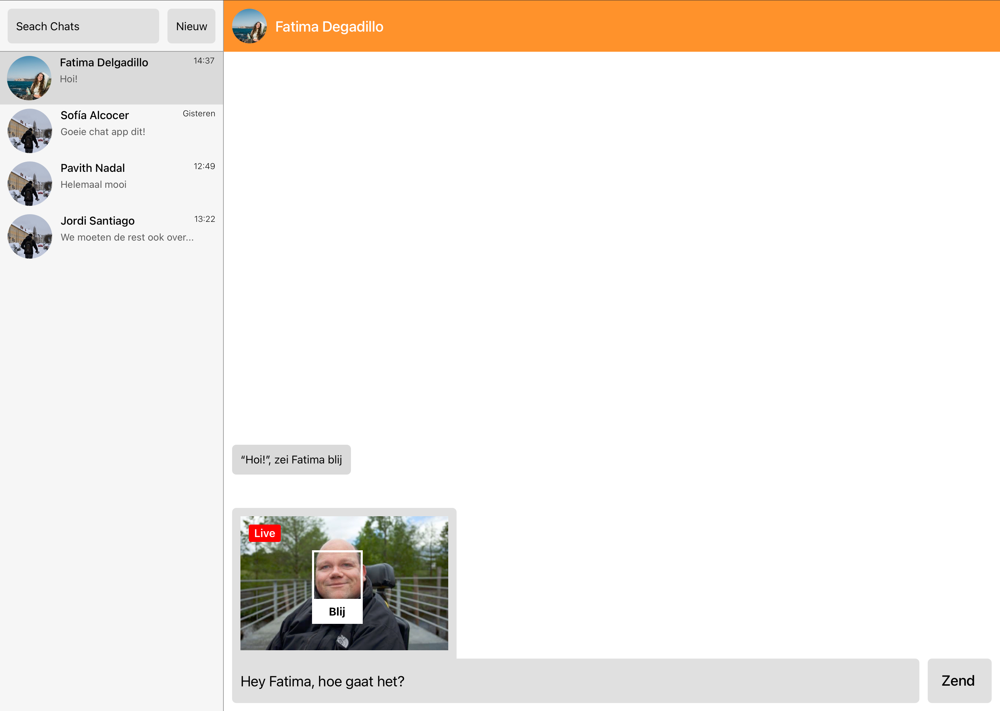
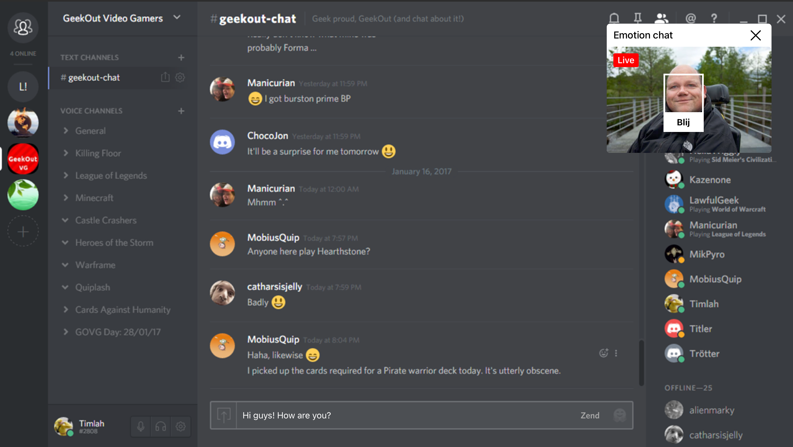
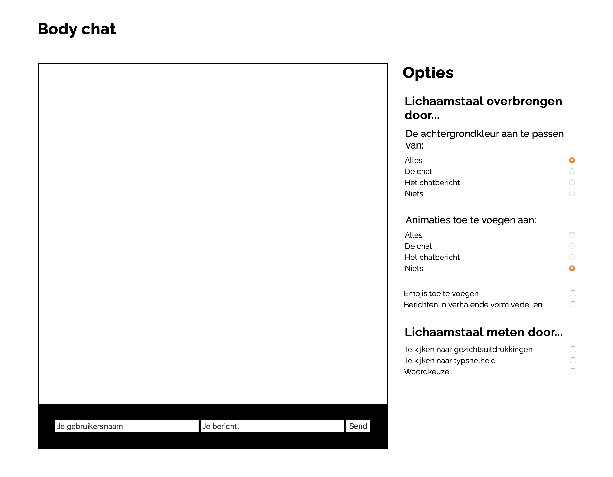
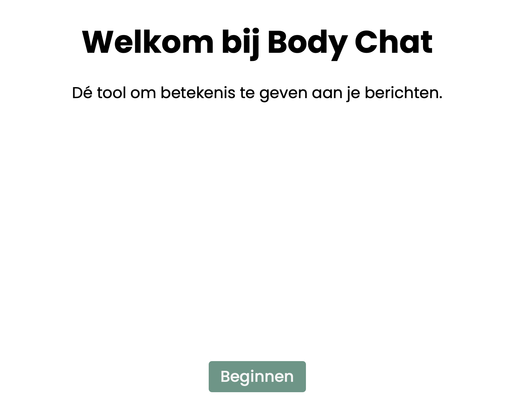
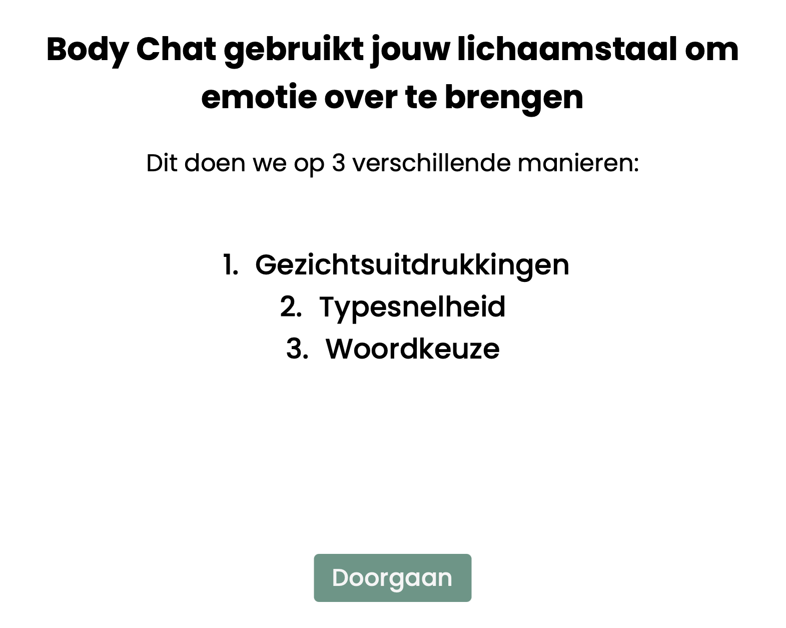
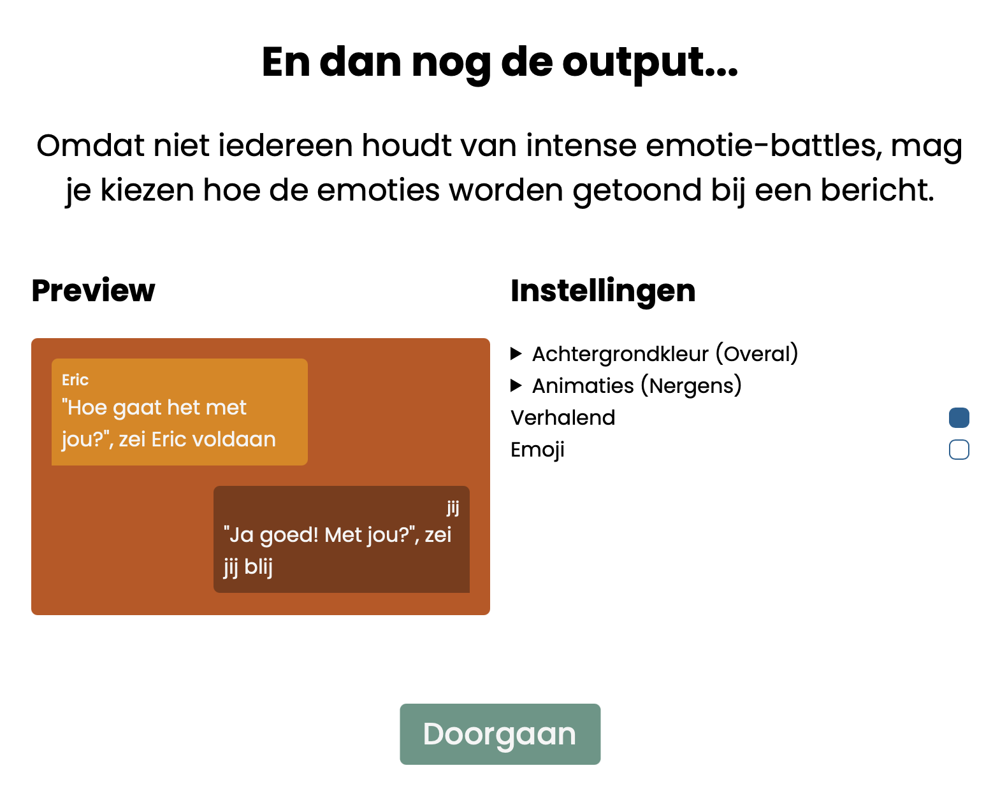
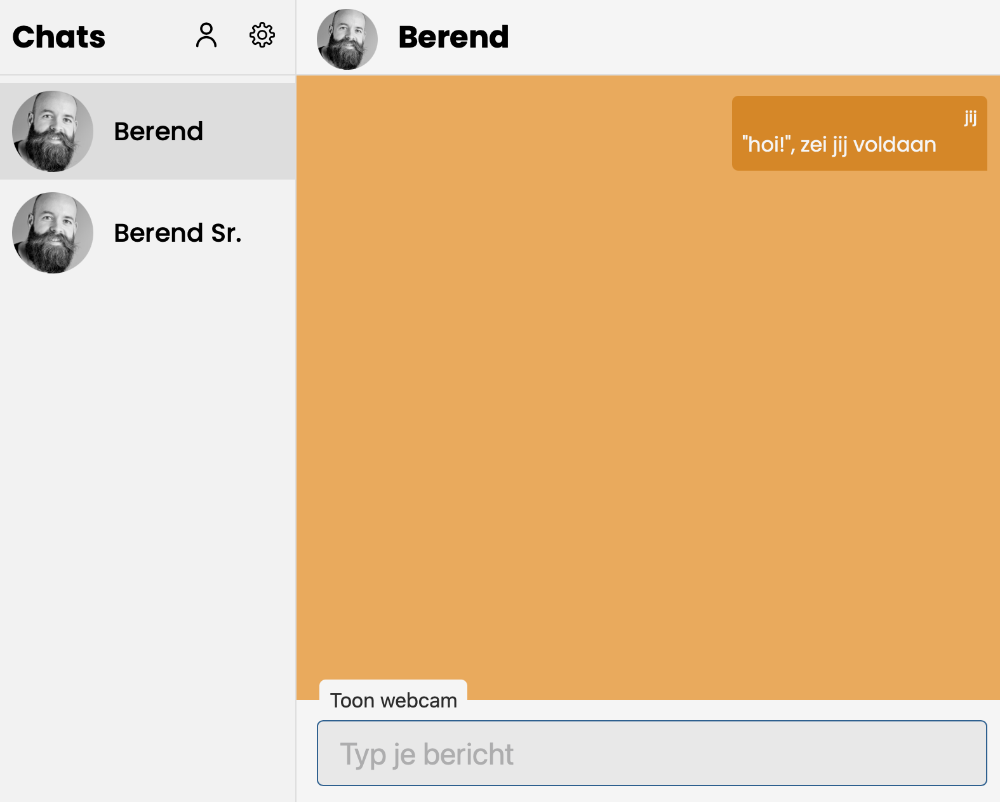
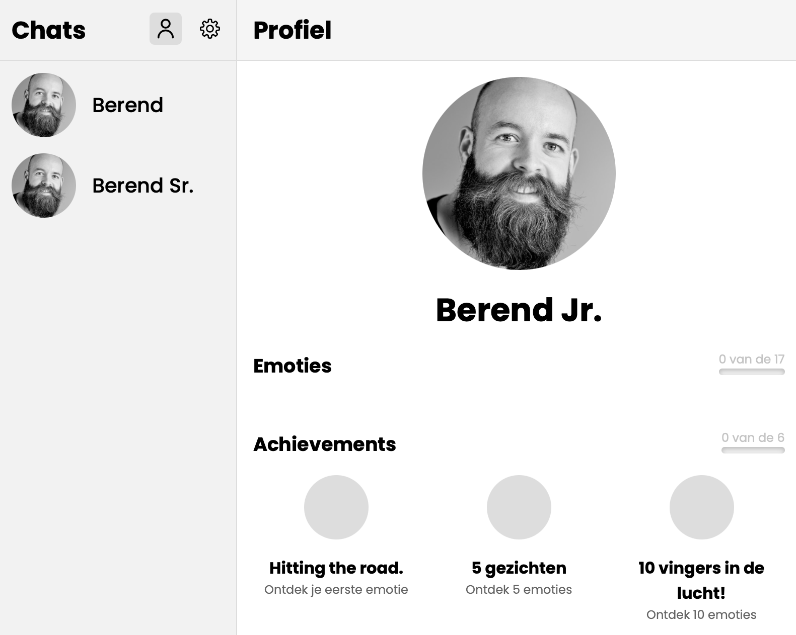
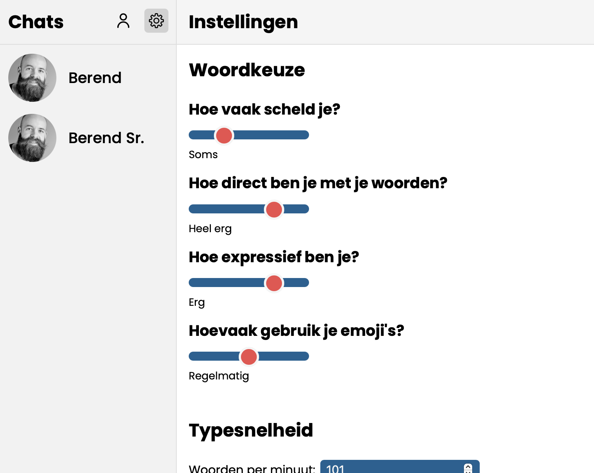
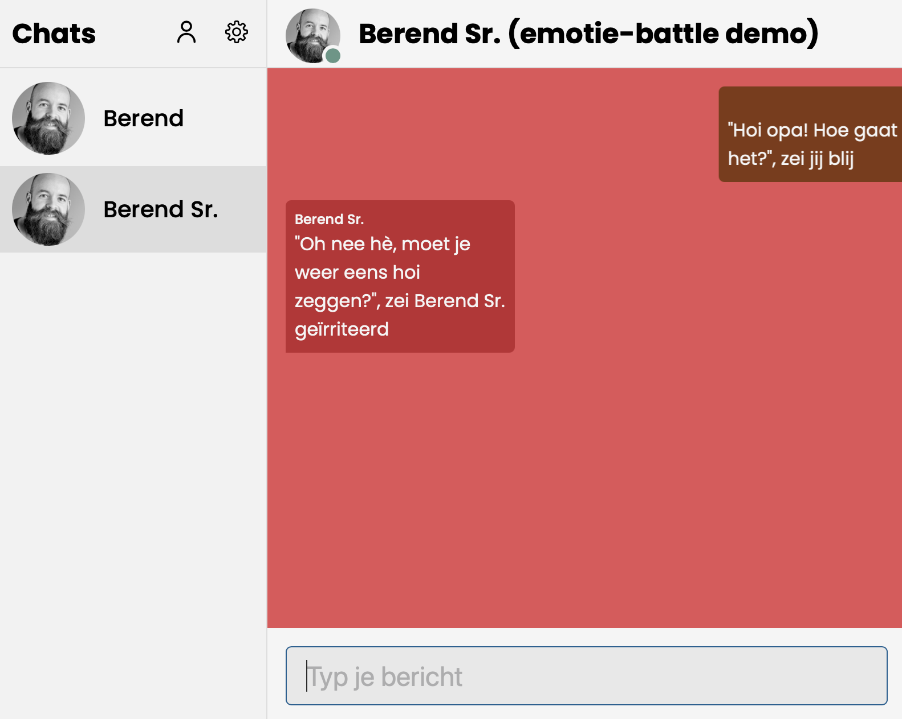

# Body chat

[Live link](https://hcd-chat.netlify.app)

Emoties overbrengen via tekst is af en toe erg ingewikkeld. Iedereen geeft zijn eigen mening aan emoji's, en het er zijn er tegenwoordig zoveel dat je soms door de bomen het bos niet meer ziet. Gifjes zijn ook niet praktisch, omdat ze meer als grap bedoeld zijn dan als een manier om emotie over te brengen. Met Body Chat wil ik dit probleem oplossen, door manieren te vinden om emoties een input én een output te geven in tekstchat.

# Inhoudsopgave

- [User Scenario](#user-scenario)
- [Design Challenge](#design-challenge)
- [Features](#features)
- [Week 1](#week-1)
- [Week 2](#week-2)
- [Week 3](#week-3)
- [Week 4](#week-4)
- [Exclusive Design](#exclusive-design)
  - [Study situation](#study-situation)
  - [Prioritise identity](#prioritise-identity)
  - [Ignore conventions](#ignore-conventions)
  - [Add nonsense](#add-nonsense)
- [Conclusie](#conclusie)

# User Scenario

Eric Groot Kormelink is een interaction designer uit Amsterdam. Hij houdt van games, muziek (power-chords in het bijzonder), heeft een gezond gevoel voor humor en is goed in zijn vak. Eric is ook fysiek beperkt. Zijn ledematen zijn tijdens de zwangerschap vergroeid, waardoor hij zijn benen niet kan gebruiken en zijn handen gekruist staan. Het maakt hem niet minder mens, en dat is zeker naar voren gekomen in de weken dat ik met hem mijn oplossingen voor zijn probleem heb mogen testen.

Hij heeft namelijk veel moeite met het gebruiken van emoji's. Iedereen geeft een eigen mening aan emoji's, er zijn tegenwoordig zoveel emoji's dat het makkelijk is om een emoji te kiezen die eigenlijk net niet lekker aansluit bij wat je beodoelt, en het kan soms flink wat tijd kosten om de emoji te vinden die je per sé wilt hebben.

Eric wilt heel graag een manier hebben om emotie en lichaamstaal over te brengen in chat-apps als Signal, Telegram, WhatsApp, etc. Zo is er geen ambiguïteit in welke emotie wordt bedoeld met emoji's, en kan je ook op onderzoek gaan naar ongewone manieren om emoties over te brengen in tekst-chat.

# Design Challenge

Ik wil voor Eric een tool maken waarmee hij op meerdere manieren emotie op kan nemen en meesturen met een chatbericht. De manier waarop de emoties in tekstberichten worden getoond zijn volledig instelbaar, met een klein snufje van Eric's en mijn persoonlijkheid daarin verwerkt.

# Features

## Must haves

- [x] Emotie input via gezichtsuitdrukking
- [x] Emotie input via typesnelheid
- [x] Emotie input via woordkeuze
- [x] Achtergrondkleuren
- [x] Animaties
- [x] Achievements
- [x] Onboarding voor de input en output van emoties.

## Should haves

- [x] Ontdekte emoties counter
- [x] Aanpasbare standaard typesnelheid
- [x] Aanpasbare woordkeuze instellingen
- [ ] Emotie en tekstinput via spraak
- [ ] Emotie input via handgebaren

## Could haves

- [ ] Aanpasbare kleuren
- [ ] Op-elkaar-inspelende emoties
  - [x] Demo van hoe dat zou kunnen werken

## Would like to haves

- [ ] Combo's (emoties, bepaalde soort woorden, etc.)

# Week 1

Voor de eerste testsessie hadden we vrij weinig tijd om wat op te zetten. We moesten snel denken, en kwamen al snel op iets wat werkt met facial recognition. Nadat ik en Roy wat onderzoek hadden gedaan hiernaar, bleek dat het makkelijk te implementeren is met JavaScript. Alles is namelijk al voorgekauwd, emotion recognition en al.

We hebben dus een kleine chat app gemaakt die met de afgelezen gezichtsemotie een kleurtje geeft aan het tekstbericht.

## Testen

De eerste testsessie was voornamelijk een kennismaking met Eric. Leren wat hij leuk en belangrijk vindt. Wel samen met een korte test van de experimenten die we klaar hadden gezet.

### Vragen

- **Wat doet u voornamelijk in uw vrij tijd?**: Lezen, films kijken, naar buiten, online gamen met mensen, rondjes rijden, muziek maken.
- **Wat vind u vervelend aan het gebruik van emoji’s?**: Vind emoties moeilijk in te schatten, omdat mensen emoties verschillend ervaren. Moeilijk om in te schatten wat voor lading achter een zin zit zonder lichaamstaal. Emojis is altijd maar de vraag of iemand dat meent.

### Hoe ging de test

Het testen zelf ging goed. De eerste indruk van het experiment was positief. Eric ging zelfs een beetje spelen met camera. Hij probeerde meerdere emoties uit, en vond het verder intuïtief werken.

### Feedback

- Sommige mensen kunnen kleuren niet goed zien, dus dat als enige manier gebruiken is niet toegankelijk.
- Dit experiment komt lichtelijk als verwacht, gezien hij wel had vernomen dat een camera nodig zou zijn.
- Tekst analyse zou ook een mooi datapunt zijn, naast gezichtsemotie.

## Wat ik meeneem naar volgende week

Van het kennismakingsgesprek neem ik het volgende mee:

- Gebruikt vaker computer, maar zit ook op zijn telefoon.
- Chat voornamelijk met kennissen en vrienden, niet vaak met vreemdelingen.
- Videobelt vaak tijdens het spelen van spelletjes.

Van de test neem ik het volgende mee:

- Meer doen dan alleen achtergrondkleur aanpassen, of iets anders doen dan achtergrondkleur aanpassen.
- Kijken naar meer opties dan alleen gezichtsuitdrukking aflezen.

# Week 2

Voor week twee ben ik aan de slag gegaan met het uitwerken van het idee van de chat app in meerdere vormen. Hierbij heb ik twee concepten bedacht die ik heb gevormd tot statische prototypes.

De manier waarop de lichaamstaal wordt ingeladen is via de webcam die de gezichtsuitdrukking opmeet. De emotie achter het bericht wordt daarmee meegestuurd in de tekst chat in een verhalende vorm, bijvoorbeeld "'Hoi!', zei Eric blij".

## Concepten

### Concept 1

Concept 1 is een losstaande chat app waarbij de lichaamstaal functie is ingebouwd.

[Prototype](https://www.sketch.com/s/5bcec281-b984-4030-9f80-94a91d68a552/a/9PWyPkQ/play)

### Concept 2

Concept 2 is een plug-in voor meerdere chat-apps die de berichten aanvult met de functie.

[Prototype](https://www.sketch.com/s/5bcec281-b984-4030-9f80-94a91d68a552/a/25e05Oy/play)

## Tweede testsessie

### User Scenarios

#### Concept 1

Je hebt net de nieuwe chat-app Emotion chat gedownloadt. Het unieke selling point van deze chat app is dat je de emotie achter het bericht kan meesturen. Een paar van je vrienden hebben de app ook al gedownload, dus je kan gelijk beginnen met gebruiken. Je hebt net een berichtje gekregen van een oude bekende vriendin Fatima, en wilt daar graag op reageren.

#### Concept 2

Je hebt net een nieuw programma gedownloadt genaamd Emotion chat. Dit programma haakt in meerdere chat apps om de berichten die je verstuurt aan te vullen met de emotie die achter het bericht zit. Je bent erg opgewonden om het uit te proberen in een van je favoriete vriendengroepen, en stuurt ze een berichtje.

### Vragen

- **Wat vind je ervan dat de feature geïntegreerd is in een unieke app?:** Raar, omdat de afbeelding niet heel duidelijk is in het prototype, of het een webcam is of niet.
- **Wat mis je in deze implementatie?**: Feedback is erg minimaal en prima, maar kleur, lettertype, animatie samen kan veel duidelijker zijn voor de gebruiker en eventueel ook intuïtiever werken. Dat samen met andere manieren van input.
- **Hoe zie je de situatie dat je vrienden overstappen naar deze app voor je?:** Zeer interessant. Een integratie in andere apps lijkt hem de beste optie.
- **Wat vind je van de plug-in implementatie tegenover de losstaande chat app?:** Eigenlijk al beantwoord, maar een integratie met andere chat apps lijkt veel fijner
- **Hoe makkelijk is het navigeren met een muis naar pop-ups?:** Dat is geen probleem.

### Opmerkingen

- Voeg meerdere bronnen toe om lichaamstaal op te pikken.
- Breidt de manieren waarop emotie wordt getoond uit.
- Niet te veel popups achter elkaar, gezien dat erg vermoeiend kan worden.
- Implementatie eigen emoticons maken best geinig.
- Beweging worden pas wel duidelijk als ze gekoppeld zijn aan een emotie, en dus bekend zijn.
- Directe feedback is belangrijk, dus niet wachten totdat Eric klaar is met input.

### Samenvatting

De manier waarop de prototypes waren opgezet kwam niet lekker over op Eric. Omdat er geen directe interactie is, kon hij geen goede indruk krijgen van de werking. Hierdoor was het lastig om de verschillende uitwerkingen te testen.

### Wat ik meeneem naar volgende week

- Focussen op het experimenteren van drie aspecten.
  - Input van lichaamstaal.
  - Tonen van lichaamstaal.
  - Flows van het verzenden van berichten.
- Focussen op de functie zelf, en niet de implementatie.

# Week 3

Voor de laatste testronde ben ik teruggegaan naar de tekentafel, en heb ik me gefocust op de feature in plaats van de implementatie ervan in verschillende omgevingen. Ik ben de feedback die ik in week 1 heb gekregen nog eens goed doorgenomen, en heb deze samen met de punten van week 2 uitgewerkt tot een concept die focust op meerdere manieren om emoties over te brengen in een chat app.

## Concept

Een chat functie waarbij je, door middel van verschillende functies, emotie kan meegeven aan een chatbericht.

### Emotie inputs

- Facial recognition
- Typsnelheid
- Woordkeuze... (stiekem scheldwoorden, maar dat heb ik er niet bij gezet).

### Emotie outputs

- Achtergrondkleur
- Animaties
- Emojis
- Berichten in verhalende vorm vertellen

## Testen

### Wat ga ik doen

Ik ga meerdere aannames testen, die ik tijdens het testen zal voorleggen om ze te bevestigen of onkrachten. De test zal erg freeform zijn, ik zal Eric namelijk de vrije keuze geven om alles in eigen tempo te testen.

### Aannames

- Andere video inputs als handbewegingen of posturen zijn overbodig.
- Emojis kunnen bruikbaar zijn voor dit probleem, mits ze voorspelbaar gebonden zijn aan emoties.
- Animaties zijn een leuke feature als ze wat extravaganter zijn.

### Vragen

- **Wat spreekt jou het meeste aan?**: Dat er meerdere dingen tegelijk gebeuren, meerdere opties hebben zijn voorkeur.
- **Wat werkt voor jou niet?**: Woordkeuze is riskant, kan het beste in combinatie met gedaan worden. Typsnelheid voegt weinig toe. Individuele opties breken snel af. Extreme animaties zijn grappig, maar niet functioneel. Het voegt wel gamification toe, en dat spreekt hem wel aan.
- **Wat mis je in dit prototype?**: Emoties op elkaar in laten spelen lijkt een leuk idee.

### Observaties

- Verhalende vorm ander lettertype.
- Emoties kloppen niet altijd.
- Emojis gingen gelijk aan.
- Gezichtsherkening ging niet van harte, Onder andere door zijn bril.
- Eric kijkt naar zijn toetsenbord wanneer hij typt.
- Woordkeuze gaat gelijk uit op positief.
- Je moet het vocabulair achterhalen van mensen om woordkeuze goed te laten werken.
- Samen praten is een leuke feature.
- Alle mogelijke opties waren niet al te duidelijk.
- Meerdere outputs moeten elkaar aanvullen, niet meer van hetzelfde bieden.
- Comics spreken hem zeer aan.
- Eric blijf het liefst zijn muis gebruiken i.p.v. te switchen van en naar zijn toetsenbord.

## Wat ik meeneem naar volgende week

- Meer gamification patterns toevoegen.
- Stripboekenstijl toepassen.
- De verschillende input en output opties onboarden.
- Woordkeuze uitbreiden voor andere emoties (spectrum)?
- Het over- en weer spelen van emoties is een leuk idee.
- Kijken naar een optie om spraak toe te voegen als een manier om berichten te sturen.
- Styling van verschillende vormen van output te veranderen.

# Week 4

## Concept

In week 4 heb ik me vooral gefocust op het aanvullen van de features die ik al had met een onboarding, achievements en een lijst met ontdekte emoties. Je kan de verschillende inputs nu ook instellen naar persoonlijke voorkeur, en de output-instellingen zijn net iets overzichtelijker. Ook heb ik een demo gemaakt om te kijken hoe de samenhang van emoties te werk zou kunnen gaan.

<figure>
  
  <figcaption>
    Je wordt begroet met een aangename introductie wanneer je de tool voor het eerst gebruikt.
  </figcaption>
</figure>

<figure>
  
  <figcaption>
    De verschillende emotie inputs worden duidelijk aan je uitgelegd met een onboarding.
  </figcaption>
</figure>

<figure>
  
  <figcaption>
    De verschillende manieren waarop emoties getoond kunnen worden zijn instelbaar.
  </figcaption>
</figure>

<figure>
  
  <figcaption>
    De chat werkt verder hetzelfde als bij de vorige iteratie.
  </figcaption>
</figure>

<figure>
  
  <figcaption>
    Je kan nu emoties verzamelen en achievements krijgen om emoties uitzoeken aantrekkelijk te maken.
  </figcaption>
</figure>

<figure>
  
  <figcaption>
    De opties die je hebt aangepast tijdens de onboarding zijn hier altijd aan te passen naar een eigen nieuwe smaak.
  </figcaption>
</figure>

<figure>
  
  <figcaption>
    Een kleine demo van hoe emoties samen zouden kunnen werken, zodat je daarvan in ieder geval een indruk kan krijgen.
  </figcaption>
</figure>

## Vervolg

In het vervolg zou ik graag willen kijken naar nog meer verschillende manieren van input, de samen- of tegenwerking van emoties en het toevoegen van extra gamification-patterns als woord- of emotie-combo's. Het gehele ontwerp omdopen naar een subtiele stripboekenstijl lijkt mij een goede aanvulling op de laatste feature ook.

# Exclusive Design

## Study situation

Study situation houdt in dat je de situatie van degene waarvoor je ontwerpt onderzoekt en gebruikt om het ontwerpprobleem op te lossen.

Ik heb dit principe toegepast door te kijken naar waar Eric moeite mee heeft, en hem dit makkelijker voor hem te maken. Eric heeft bijvoorbeeld moeite met snel typen, dus heb ik een typesnelheidstest gemaakt die kijkt naar wat de gemiddelde typesnelheid is van de gebruiker om zo een "baseline" typesnelheid op te zetten.

## Ignore conventions

Ignore conventions zet out-of-the-box denken centraal, en moedigt je aan om te experimenten alsof design patterns niet bestaan. Veel design patterns werken niet voor iedereen, dus is het belangrijk dat je gaat kijken wat wel werkt voor de mensen voor wie je ontwerpt, en dit ook goed te testen met die mensen.

Ik heb dit toegepast door op verschillende manieren te kijken naar hoe Eric zijn computer het makkelijkst gebruikt voor tekst chat. Hij zit in een hele andere situatie dan ik, dus ik moet ervoor zorgen dat de tools die ik hem geef om emotie op te nemen werken voor hem, niet alleen voor mij. Ik heb dit bijvoorbeeld gedaan door typesnelheid te testen i.p.v. een standaard aantal woorden per minuut te gebruiken voor verschillende emoties, en voor woordkeuze meer fine-tuning te geven, zodat de basis al flink is toegespitst op wie de tool gebruikt.

## Prioritise identity

Prioritise identity is het principe wat de persoonlijkheid van de persoon voor wie je ontwerpt centraal stelt. Dit te doen door delen van deze persoonlijkheid mee te nemen in het ontwerp.

Eric vindt gamen heel erg leuk, en hij is een interactieontwerper. Toen ik hem het prototype van week 3 voorschotelde, vond hij de uitbundige animaties echt fantastisch, en moest hij hardop lachen. Hij wilde ze gelijk allemaal proberen te ontdekken, om te zien welke animatie er tevoorschijn zou komen. Deze feedback heb ik ten harte genomen, door een teller te maken die bijhoudt hoeveel emoties je hebt ontdekt en achievements toe te voegen voor bepaalde aantallen ontdekte emoties en een paar moeiljk-te-bereiken emoties (welke dat zijn mag je zelf uitzoeken).

## Add nonsense

Add nonsense is het principe dat mooi samenhangt met prioritise identity (althans, dat vind ik). Door nonsens toe te voegen, geef je je tool karakter, en begint het los te komen van de massa aan tools die al bestaan op het internet. De dingen die mensen leuk vinden zijn vaak genoeg nonsens namelijk.

Ik heb dit toegepast door zeer uitbundige animaties toe te voegen, achievements toe te voegen in een chat-app tool, een optie toegevoegd om tekstberichten in verhalende vorm te vertellen. Zo hoop ik dat Eric een zeer leuke en persoonlijke ervaring heeft.

# Conclusie

Deze afgelopen 4 weken waren enorm leerzaam voor mij. Ik heb heel erg out-of-the-box kunnen denken en een zeer unieke ervaring kunnen ontwerpen voor Eric. De design principes van Exclusive Design zijn erg eye-opening. Vooral omdat het mij in een andere mindset heeft gebracht. Ik ging echt mijn aannames op de proef stellen, in plaats van ze proberen te bevestigen. Ik ben ook minder bang om lekker gek te doen, want het pakt vaak genoeg zeer goed uit!

Het werdt mij steeds duidelijker wat de needs waren van Eric. Ook met dank aan het gesprek met Thijs wat ik had in week 2. Het maakte een stuk duidelijker dat ik een stap terug moest zetten en te kijken naar wat de essentie is van Eric's probleem, en dat aanpakken. Ik heb hierdoor geleerd zijn needs centraal te zetten, en vandaaruit te ontwerpen.

In week 2 had ik erg veel moeite met itereren. Het was alsof ik was vergeten wat mijn inzichten van de eerste week waren, en met een schone lei was begonnen. Ik was helemaal de weg kwijt, maar ik heb het idee dat ik met in week 3 goed heb herpakt en sterker terug ben gekomen dan dat ik weg ben gegaan. Voelt een beetje aan als een redemption arc. Ik heb in ieder geval een new-found appreciation voor de manier waarop we hebben getest deze weken; heel free-form, hands-off en observerend in plaats van gericht. Ik denk dat je zo veel meer inzichten krijgt dan wanneer je een bepaald scenario doorloopt met je gebruiker, omdat je de manier waarop de gebruiker je ontwerp gebruikt niet aan banden legt.

Al met al was dit een extreem leerzaam vak voor mij, en ben erg blij met waar ik ben gekomen in 4 weken tijd.
